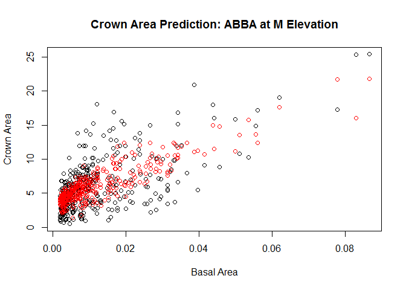
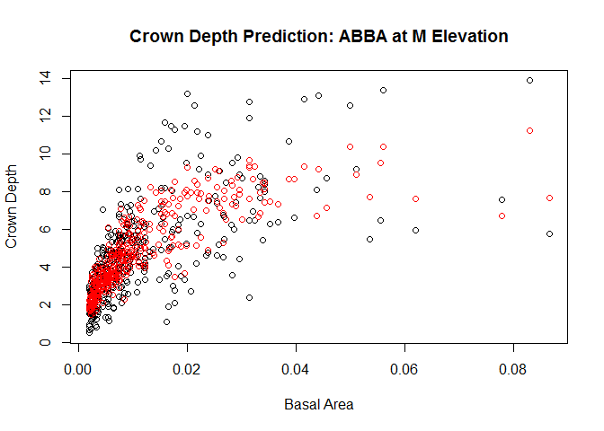

## These scripts predict crown dimensions
Crown depth (distance from lowest to highest point of crown) and crown area (as a horizontal slice through the crown at its widest position) are predicted.  The predictions are constructed using data collected in 1986/87.  Data was available for the following species/elevations:

```
##       
##              H   L   M
##          0   0   0   0
##   ABBA   0 252  53 376
##   ACPE   0   0   1   0
##   ACSA   0   0   4   0
##   ACSP   0   0   0   0
##   BEAL   0   0  11   4
##   BECO   0  49  23 226
##   BEPA   0   0   1   9
##   FAGR   0   0   0   0
##   PIRU   0  30  13  62
##   PRPE   0   0   4   0
##   PRVI   0   0   0   0
##   SOAM   0   4   1   6
##   UNID   0   0   0   0
```
Due to limited data, models were constructed for the following species/combinations of species: ABBA, PIRU, BECO/BEAL/BEPA (combined into one model), and all hardwoods combined.  Each of the four groups was modeled at three elevations (L/M/H).

## Models
### Crown area
$Crown area = a*BA^b + c*HT$, 
where BA is basal area and HT is height.

### Crown depth
Crown depth is currently just a linear model of tree height:
$Crown depth = a*HT$

## Example predictions
  

