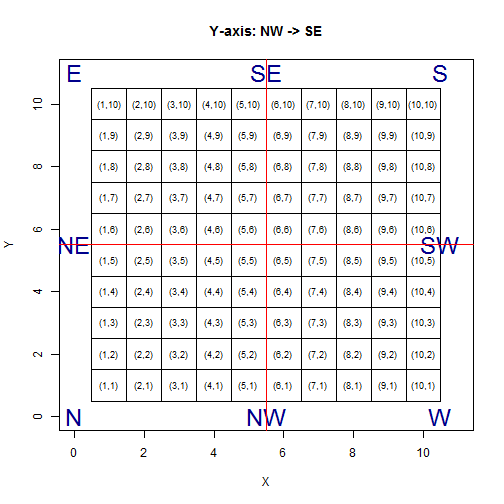
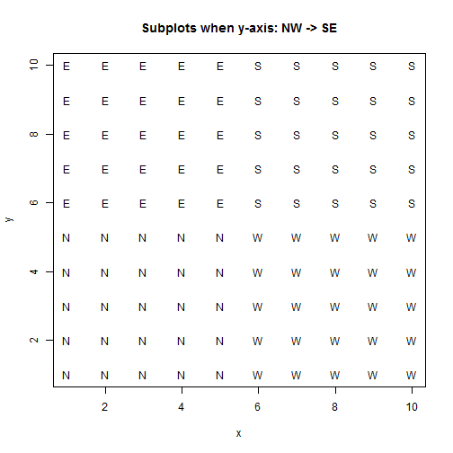

Transform x,y coordinates
========================================================

Scripts to convert between different representations of the x,y coordinates in plots.


## Moosilauke plot directions

### y-axis on NW -> SE

```r
plot(0:11, 0:11, type = "n", xlab = "X", ylab = "Y", main = "Y-axis: NW -> SE")
addl <- sapply(0.5:10.5, function(i) {
    lines(x = c(i, i), y = c(0.5, 10.5))
    lines(x = c(0.5, 10.5), y = c(i, i))
})
text(x = c(0, 0, 0, 5.5, 10.5, 10.5, 10.5, 5.5), y = c(0, 5.5, 11, 11, 11, 5.5, 
    0, 0), labels = c("N", "NE", "E", "SE", "S", "SW", "W", "NW"), cex = 2, 
    col = "dark blue")  # directions
addq <- sapply(1:10, function(i) {
    labs = paste0("(", rep(i, 10), ",", 1:10, ")")
    text(rep(i, 10), 1:10, labels = labs, cex = 0.75)
})
abline(h = 5.5, v = 5.5, col = "red")
```

 


## Subplots when y-axis is along NW->SE
Add a factor for which subplot a quadrat is in (N,S,E,W).

```r
samp <- expand.grid(x = 1:10, y = 1:10)
samp$quad <- factor(x = ifelse(samp$x < 5.5 & samp$y < 5.5, "N", ifelse(samp$x < 
    5.5, "E", ifelse(samp$y < 5.5, "W", "S"))))
plot(samp$x, samp$y, type = "n", xlab = "x", ylab = "y", main = "Subplots when y-axis: NW -> SE")
text(x = samp$x, y = samp$y, label = samp$quad)
```

 


```
