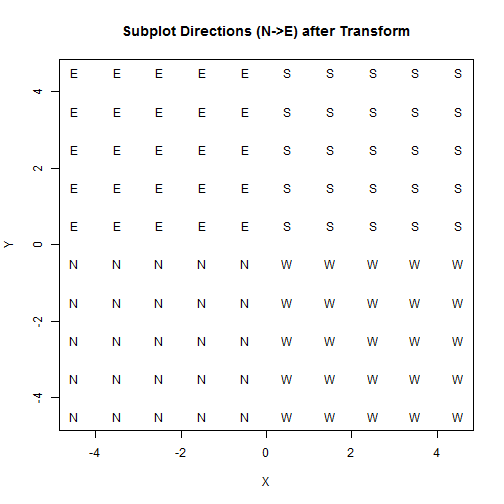

Transform x,y coordinates
========================================================

Scripts to convert between different representations of the x,y coordinates in plots.


## Examine original quadrat design

### First possibility, y-axis on N -> E

```r
source("~/work/ecodatascripts/vars/xy-values/functions.R")

plot(0:11, 0:11, type = "n", xlab = "X", ylab = "Y", main = "Y-axis: N -> E")
addl <- sapply(0.5:10.5, function(i) {
    lines(x = c(i, i), y = c(0.5, 10.5))
    lines(x = c(0.5, 10.5), y = c(i, i))
})
text(x = c(0, 0, 0, 5.5, 10.5, 10.5, 10.5, 5.5), y = c(0, 5.5, 11, 11, 11, 5.5, 
    0, 0), labels = c("N", "NE", "E", "SE", "S", "SW", "W", "NW"), cex = 2, 
    col = "dark blue")  # directions
addq <- sapply(1:10, function(i) {
    labs = paste0("(", rep(i, 10), ",", 1:10, ")")
    text(rep(i, 10), 1:10, labels = labs, cex = 0.75)
})
abline(h = 5.5, v = 5.5, col = "red")
```

 


### Second possibility, y-axis on N -> W

```r
plot(0:11, 0:11, type = "n", xlab = "X", ylab = "Y", main = "Y-axis: N -> W")
addl <- sapply(0.5:10.5, function(i) {
    lines(x = c(i, i), y = c(0.5, 10.5))
    lines(x = c(0.5, 10.5), y = c(i, i))
})
text(x = c(0, 0, 0, 5.5, 10.5, 10.5, 10.5, 5.5), y = c(0, 5.5, 11, 11, 11, 5.5, 
    0, 0), labels = c("N", "NW", "W", "SW", "S", "SE", "E", "NE"), cex = 2, 
    col = "dark blue")  # directions
addq <- sapply(1:10, function(i) {
    labs = paste0("(", rep(i, 10), ",", 1:10, ")")
    text(rep(i, 10), 1:10, labels = labs, cex = 0.75)
})
abline(h = 5.5, v = 5.5, col = "red")
```

 


## Sample data when y-axis is along N->E
Add a factor for which subplot a quadrat is in (N,S,E,W).

```r
samp <- expand.grid(x = 1:10, y = 1:10)
samp$quad <- factor(x = ifelse(samp$x < 5.5 & samp$y < 5.5, "N", ifelse(samp$x < 
    5.5, "E", ifelse(samp$y < 5.5, "W", "S"))))
plot(samp$x, samp$y, type = "n", xlab = "x", ylab = "y", main = "Subplots when y-axis: N -> E")
text(x = samp$x, y = samp$y, label = samp$quad)
```

 


## Transform sample data and plot the directional layout

```r
samp$xt <- center_quadrats(samp$x)
samp$yt <- center_quadrats(samp$y)

## Plot transformed data
plot(samp$xt, samp$yt, type = "n", main = "Subplot Directions (N->E) after Transform", 
    ylab = "Y", xlab = "X")
text(x = samp$xt, y = samp$yt, label = samp$quad)
```

 


## Possible directions of y-axis in transformed data:
1. If Y-axis goes **N -> E**, then y-axis is NW -> SE on transformed data.
 * In this case, offset of y-axis from north is $135^\circ$ ($\frac{3\pi}{4}$)
 
2. If Y-axis goes **N -> W**, then y-axis is NE -> SW on transformed data
 * In this case, offset of y-axis from north is $225^\circ$ ($\frac{5\pi}{4}$)

## Convert real data

```r
dat <- read.csv("~/work/data/data/moose-wide.csv")
dat$x <- center_quadrats(dat$bqudx)
dat$y <- center_quadrats(dat$bqudy)

## Compare numbers of each
orig <- table(dat$bqudx, dat$bqudy)
trans <- table(dat$x, dat$y)
orig[2:11, 2:11] == trans
```

```
##     
##         1    2    3    4    5    6    7    8    9   10
##   1  TRUE TRUE TRUE TRUE TRUE TRUE TRUE TRUE TRUE TRUE
##   2  TRUE TRUE TRUE TRUE TRUE TRUE TRUE TRUE TRUE TRUE
##   3  TRUE TRUE TRUE TRUE TRUE TRUE TRUE TRUE TRUE TRUE
##   4  TRUE TRUE TRUE TRUE TRUE TRUE TRUE TRUE TRUE TRUE
##   5  TRUE TRUE TRUE TRUE TRUE TRUE TRUE TRUE TRUE TRUE
##   6  TRUE TRUE TRUE TRUE TRUE TRUE TRUE TRUE TRUE TRUE
##   7  TRUE TRUE TRUE TRUE TRUE TRUE TRUE TRUE TRUE TRUE
##   8  TRUE TRUE TRUE TRUE TRUE TRUE TRUE TRUE TRUE TRUE
##   9  TRUE TRUE TRUE TRUE TRUE TRUE TRUE TRUE TRUE TRUE
##   10 TRUE TRUE TRUE TRUE TRUE TRUE TRUE TRUE TRUE TRUE
```

