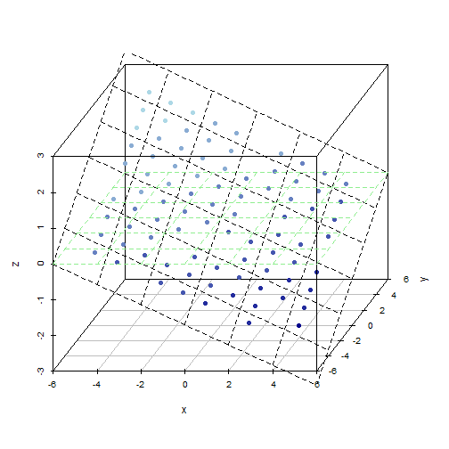

## These scripts compute altitude values (z-values)
Z-values are altitude values relative to the center of the plots.

### Method to calculate z-values
1. $z = r\cos(\theta_B) \tan(\theta_S)$, where $\theta_B$ is the angle between the slope aspect and the vector from a given point through the origin, $\theta_S$ is the slope angle. and $r$ is the distance from the origin to the point.
  * $\theta_B$ is calculated from dot product of the projection of the slope aspect onto the 2d plot, $a$, and the vector from a given point through the origin, $b$:
  * $\theta_B = cos^{-1} ( \frac{ a \cdot b } {|a||b| } )$
  * Using this method, if $\theta_B > 90^{\circ}$, then $z$ will be a negative value, ie. downslope from the center of the plot.
2. Notes
  * Due to machine precision error with the arccos function, $\frac{a \cdot b}{|a||b|}$ was rounded to 15 digits (machine precision ~ $2e-16$).  When $a \cdot b$ is very close to $|a||b|$, (i.e. they are the same in reality), the fraction is sometimes computed to be slightly greater than 1 on the machine which leads to a NAN result when passed to the arccos function in R.

### Moosilauke
* On Moosilauke, each plot has an azimuth and slope calculate along the azimuth.  Z-value are calculated from these values in addition to plant x,y coordinates.
* The y-axis is oriented in the northeast direction for Moosilauke plots.
* The slope azimuth points downslope.  So, the slope from the top of the plot looking downhill through the origin.

## Example: Moosilauke permanent plot 22 

The aspect of this plot points directly west ($270^\circ$)
### Data and function dependencies

```r
source("~/work/ecodatascripts/vars/z-values/functions.R")
dat <- read.csv("~/work/data/data/moose-wide.csv")
dat$slope <- 2 * pi/360 * dat$slope8687  # convert slope to radians
dat$aspect <- 2 * pi/360 * dat$asp  # convert aspect to radians

tst <- dat[dat$pplot == 22, ]  # plot 22

## Change quadrat layout to coordinates, origin is center of plot
tst$x <- center_quadrats(tst$bqudx)
tst$y <- center_quadrats(tst$bqudy)
```


### Lattice Plot of altitudes at the base of trees in plot 22

```r
## Plot z-values for test plot
plotzvals(tst, slope = "slope", aspect = "aspect")
```

```
## Loading required package: scatterplot3d
```

 


